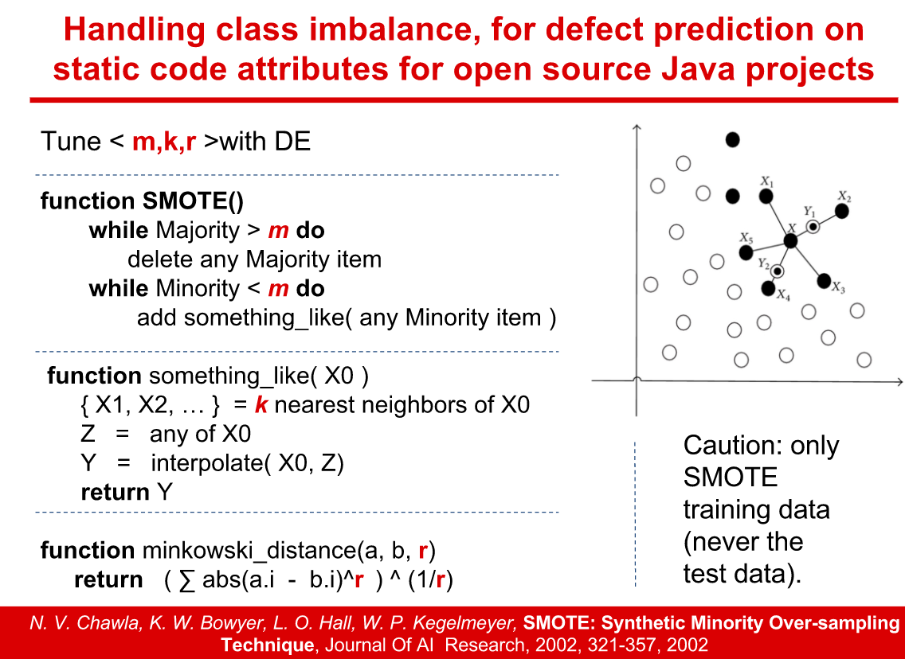

# Citation Sentiment Classifier

## Description: 

Detailed Report can be accessed [HERE](https://github.com/HuyTu7/sentiment_citation/blob/master/reports/Repeatability_SelfTuning_SA_Citations.pdf)!

Sentiment analysis of scientific citations have been well-studied recently for bibliometrics (the measures of popularity and the impact of the published research). Most research work on this topic have only attempted to use complex, slow, and thorough off-the-shelf models for their problems. 

Proposed Hypothesis: Dimensionality Reduction with performing Undersampling and Oversampling technique and Tuning will get comparable results. 

Proposed methods: 
- Principal Component Analysis (PCA)
- Synthetic Minority Over-sampling Technique (SMOTE)
- Tuning with Differential Evolution Algorithms


## Dataset:

Data for citation sentiment classification reported in the [Sentiment Analysis of Citations using Sentence Structure-Based Features](http://www.aclweb.org/anthology/P11-3015) paper. <br>
The file test.arff contains only the test set with dependency triplets generated with Stanford CoreNLP. <br> 
Full corpus available at [here](http://www.cl.cam.ac.uk/~aa496/citation-sentiment-corpus).

1. 7261 citation contexts
2. 209795 words/phrases features + 88031 dependencies features
3. Classes distribution:
  - Objective [‘o’] - 6276 (86.43%)
  - Positive [‘p’] - 742 (10.22%)
  - Negative [‘n’] - 243 (3.35%)


## Implementation:

#### Model:


#### Feartures Reduction - PCA:


#### SMOTE:


#### Params to be Optimized per Learner:

- RF: max_features, max_leaf_nodes, min_samples_split, & n_estimators
- SVM: kernels, coef0, & C
- CART: max_features, max_depth, min_samples_split, & n_estimators
- KNN: n_neighbors & weights

#### Results: 


## Files:
```
sentiment_citation/
├── document/
│   ├── proposal.pdf
│   ├── final.pdf
├── data/
│   ├── test.arff
├── preprocess/
|   ├── features_engineer.py    
│   ├── readarff.py
├── work/    
│   ├── experiment_v1.ipynb
│   ├── experiment_v2.ipynb
│   ├── de_tuner.py
|   ├── learners.py
|   ├── tuning.py
```

## Requirements:

- Python 2.7
- scikit-learn
- pandas
- numpy
